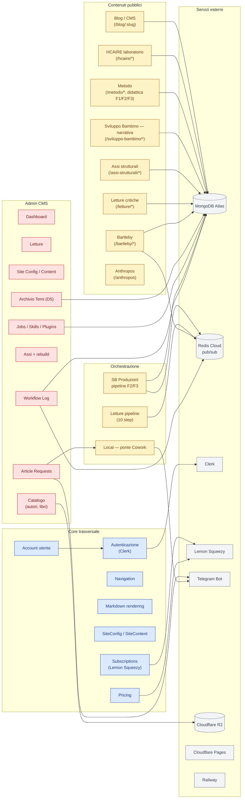

# Mappa dei moduli

Vista logica delle aree dell'app e delle loro dipendenze. Tutto è in scope.

## Mappa moduli ↔ pagine ↔ endpoint

| Modulo | Pagine FE | Endpoint server |
|--------|-----------|-----------------|
| **Blog / CMS** | `/`, `/blog/:slug`, `/about` | `GET/POST/PUT/DELETE /api/contents`, `GET /api/admin/contents`, `POST /api/contents/import` |
| **Navigation** | (componente globale) | `GET /api/navigation`, modifie admin |
| **Account** | `/account` | `GET /api/subscriptions/status` |
| **Pricing** | `/pricing` | (statico + Lemon Squeezy checkout) |
| **Subscriptions** | (componente) | `GET /api/subscriptions/status`, `POST /webhooks/lemonsqueezy` |
| **SiteConfig / SiteContent** | `/admin/site-config`, `/admin/testi` | `GET /api/site-config`, `GET /api/site-content`, modifie admin |
| **HCAIRE laboratorio** | `/hcaire`, `/hcaire/protocolli`, `/hcaire/protocolli/:slug`, `/hcaire/:section` | `GET /api/hcaire/*` |
| **Metodo** | `/metodo`, `/metodo/introduzione`, `/metodo/fasi`, `/metodo/fasi/:slug`, `/metodo/ricerca-scientifica`, `/metodo/rapporto-con-ia`, `/metodo/didattica/*` | `GET /api/metodo/*` |
| **Sviluppo Bambino — narrativa** | `/sviluppo-bambino`, `/sviluppo-bambino/finalita`, `/sviluppo-bambino/concetti`, `/sviluppo-bambino/nota-metodologica`, `/sviluppo-bambino/riflessioni`, `/sviluppo-bambino/interlocuzioni/*`, `/sviluppo-bambino/modello/*` | `GET /api/sviluppo-bambino/*` |
| **Sviluppo Bambino — Produzioni (pipeline F2/F3)** | `/sviluppo-bambino/produzioni*` (landing, temi, pipeline map, ricerche, temi/device, stress-test) | `GET /api/pipeline/*`, `POST /api/pipeline/executions`, `POST /api/pipeline/external-inputs`, `POST /api/pipeline/decisions` |
| **Assi strutturali** | `/assi-strutturali`, `/assi-strutturali/capitoli`, `/assi-strutturali/bibliografia`, `/assi-strutturali/:asseSlug`, `/assi-strutturali/:asseSlug/:chapterSlug` | `GET /api/assi`, `GET /api/admin/assi-chapters/*`, modifie admin |
| **Letture critiche** | `/letture`, `/letture/elenco`, `/letture/:slug`, `/admin/letture/*` | `GET /api/letture/*`, `POST /api/admin/letture/:slug/steps/:step_id/run` |
| **Bartleby** | `/bartleby`, `/bartleby/console`, `/bartleby/knowledge-base/*`, `/bartleby/outputs`, `/bartleby/outputs/:id` | `GET /api/bartleby/*`, `POST /api/bartleby/output-documents`, `POST /api/bartleby/traces` |
| **Anthropos** | `/anthropos` | (statico) |
| **Archivio Temi (D5)** | `/archivio/temi`, `/archivio/temi/nuovo`, `/archivio/temi/:id` | `GET/POST/PATCH/DELETE /api/archivio/temi` |
| **Catalogo (autori/libri)** | `/admin/catalogo`, (uso pubblico in Bibliografia) | `GET/POST/PATCH/DELETE /api/admin/catalog/{authors,books}` |
| **Article Requests + Telegram/Cowork** | `/admin/requests` | `GET/POST /api/article-requests`, listener Telegram + Cowork CLI |
| **Workflow Log** | `/admin/workflow` | (lettura `WorkflowLog`) |
| **Skills / Plugins / Jobs** | `/admin/skills`, `/admin/plugins`, `/admin/job-definitions`, `/admin/jobs` | `GET/POST/PUT/DELETE /api/admin/{skills,plugins,job-definitions,job-requests}` |

Per il dettaglio di rotte ed entrypoint vedi:

- [Routing](../10-architecture/routing.md) per la mappa completa FE + BE
- [Inventario tecnico](./inventario.md) per controller, model e service per modulo
