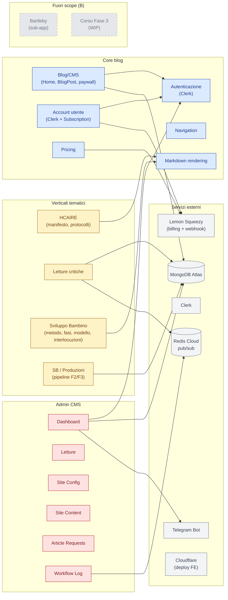

# Mappa dei moduli

Vista logica delle aree dell'app e delle loro dipendenze. **Scope B**: i moduli grigi sono fuori scope (vedi nota in fondo).

## Mappa moduli ↔ pagine ↔ endpoint

| Modulo | Pagine FE | Endpoint server |
|--------|-----------|-----------------|
| **Blog/CMS** | `/`, `/blog/:slug`, `/about` | `GET/POST/PUT/DELETE /api/contents`, `GET /api/contents/admin`, `POST /api/contents/import` |
| **Navigation** | (componente globale) | `GET /api/navigation` |
| **Account** | `/account` | `GET /api/subscriptions/me` (e webhook LS) |
| **Pricing** | `/pricing` | (statico) |
| **Article Requests** | `/admin/requests` | `GET/POST /api/article-requests` |
| **Site Config** | `/admin/site-config` | `GET/PUT /api/site-config` |
| **Site Content** | `/admin/testi` | `GET /api/site-content`, `GET/PUT /api/admin/site-content` |
| **HCAIRE** | `/hcaire`, `/hcaire/protocolli`, `/hcaire/protocolli/:slug`, `/hcaire/:section` | `GET /api/hcaire/`, `/api/hcaire/:section`, `/api/hcaire/:section/:subsection` |
| **Letture** | `/letture`, `/letture/elenco`, `/letture/:slug`, `/admin/letture/*` | `GET /api/letture/*`, `GET/POST/PATCH/DELETE /api/admin/letture/*`, `POST /api/admin/letture/:slug/steps/:step_id/run` |
| **Sviluppo Bambino — narrativa** | `/sviluppo-bambino/*` (≈18 route: finalita, metodo, fasi, concetti, modello, assi, interlocuzioni, riflessioni…) | `GET /api/sviluppo-bambino/*` (≈22 endpoint specchio) |
| **Sviluppo Bambino — Produzioni** | `/sviluppo-bambino/produzioni*` (landing, temi, pipeline map, dispositivo, stress test) | `GET /api/pipeline/*` + file statici sotto `/pipeline/` (vedi modulo) |
| **Assi strutturali (top-level)** | `/assi-strutturali*` | come SB narrativa (assi) |
| **Workflow Log** | `/admin/workflow` | (Redis-driven, `WorkflowLog` model) |

## Fuori scope (per questa fase di documentazione)

- **Bartleby** (`/bartleby/*`, `/api/bartleby/*`, modelli sotto `server/src/models/bartleby/`) — sub-app separata che ha già il proprio `CLAUDE_bartleby.md`. Sarà documentata in un capitolo dedicato successivo.
- **Corso Fase 3** (`/sviluppo-bambino/strumenti-operativi-contestualizzati/*`) — in lavorazione (file untracked m02–m08). Sarà documentato quando converge.

I corsi **F1** (fondazione ontologica) e **F2** (traduzione interdisciplinare) sono inclusi nello scope perché stabili.
