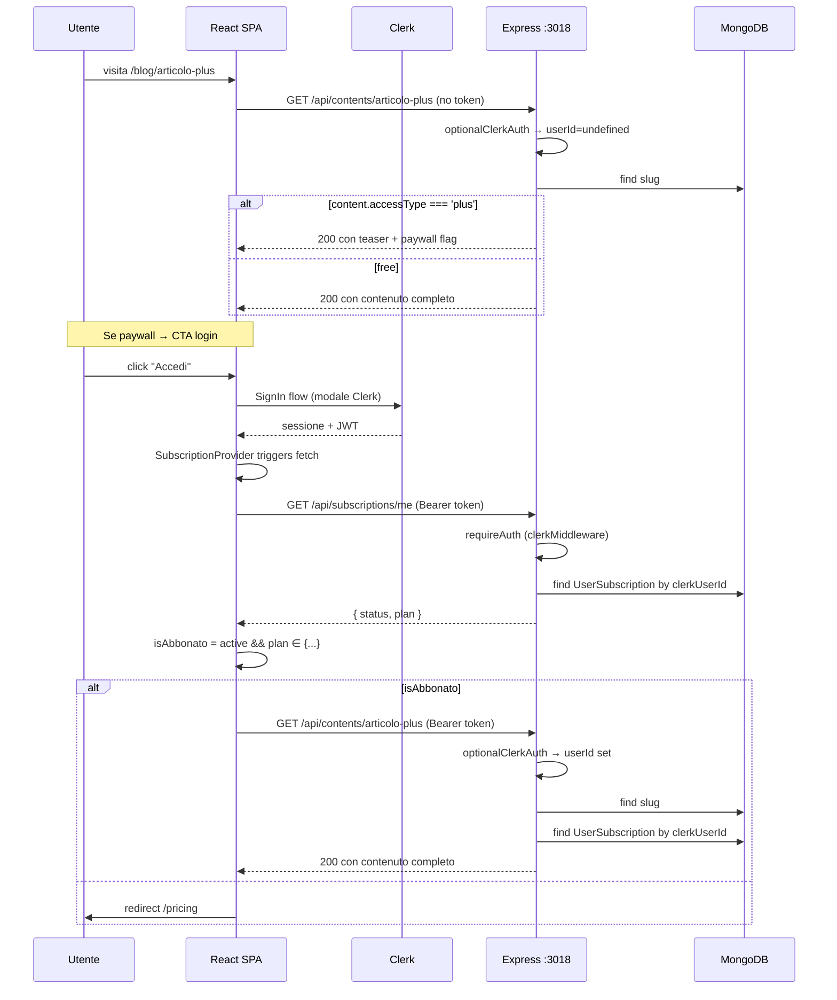

# Autenticazione

L'app usa **Clerk** come unico provider di identità per gli utenti finali e gli admin. Esiste anche un canale **API key** (`COWORK_API_KEY`) per automazioni esterne, e un firmaggio **HMAC SHA256** per il webhook Lemon Squeezy. Il vecchio JWT custom citato in `CLAUDE.md` è dead code.

## 1. Modello concettuale

| Soggetto | Sorgente identità | Cosa sblocca |
|----------|-------------------|--------------|
| Lettore anonimo | Nessuna | Contenuti `accessType: 'free'` |
| Utente registrato (free) | Clerk session | Account, contenuti free |
| Utente plus | Clerk + `UserSubscription.status === 'active'/'on_trial'` con `plan` ∈ `{abbonato, bartleby, bartleby_plus}` | Contenuti `accessType: 'plus'`, funzionalità Bartleby |
| Admin | Clerk session + `publicMetadata.role === 'admin'` | Dashboard `/admin/*`, route `/api/admin/*` |
| Automazione esterna | API key in header `Authorization: Bearer <COWORK_API_KEY>` | `POST /api/contents/import` |
| Lemon Squeezy | Firma HMAC SHA256 sul body raw | `POST /webhooks/lemonsqueezy` |

## 2. Flusso login → contenuto plus



Il punto sottile: la stessa rotta `GET /api/contents/:slug` cambia comportamento in base alla presenza di `userId` (e quindi di un abbonamento attivo). Il middleware è `optionalClerkAuth`, non `requireAuth`.

## 3. Frontend: ClerkProvider e hook

`App.tsx`:

```tsx
const clerkPublishableKey = import.meta.env.VITE_CLERK_PUBLISHABLE_KEY;

<ClerkProvider publishableKey={clerkPublishableKey}>
  ...
</ClerkProvider>
```

I componenti consumano due hook principali:

- **`useUser()`** — sessione e profilo, usato in `AdminRoute` per leggere `user.publicMetadata.role`.
- **`useAuth()`** — espone `getToken()` per ottenere il JWT Clerk da inviare come `Authorization: Bearer ...` alle rotte protette. Esempio in `SubscriptionContext`:

```ts
const { getToken, isSignedIn } = useAuth();
const token = await getToken();
const data = await getSubscriptionStatus(token);
```

### `AdminRoute`

```tsx
function AdminRoute({ children }) {
  const { isLoaded, isSignedIn, user } = useUser();
  if (!isLoaded) return <Spinner />;
  if (!isSignedIn || user?.publicMetadata?.role !== 'admin') {
    return <p>Accesso riservato agli amministratori.</p>;
  }
  return <AdminLayout>...</AdminLayout>;
}
```

Il check è **esclusivamente UX**. Tutte le rotte API admin ripetono il controllo lato server.

## 4. Backend: middleware Clerk

`server/src/middleware/clerkAuth.ts` espone tre primitivi:

```ts
// Globale, già montato in index.ts:
app.use(clerkMiddleware());

// Per route protette:
export const authenticateClerk = requireAuth();   // 401 se non autenticato

// Per route opzionalmente autenticate:
export const optionalClerkAuth = (req, _res, next) => {
  const auth = getAuth(req);
  req.clerkUserId = auth.userId ?? undefined;
  next();
};

// Per route admin (chiama Clerk API):
export const requireAdmin = async (req, res, next) => {
  const { userId } = getAuth(req);
  if (!userId) return res.status(401).json({ error: 'Autenticazione richiesta' });
  const clerkClient = createClerkClient({ secretKey: process.env.CLERK_SECRET_KEY! });
  const user = await clerkClient.users.getUser(userId);
  if (user.publicMetadata?.role !== 'admin') return res.status(403).json(...);
  req.clerkUserId = userId;
  next();
};
```

### Punti di attenzione

- **`clerkMiddleware()` globale**: applicato a tutte le route `/api/*` (montato in `index.ts` prima del mount delle route, dopo `/webhooks` e prima di `express.json`). Se mancasse, `requireAuth()` e `getAuth(req)` non avrebbero la sessione iniettata.
- **`requireAdmin` chiama Clerk per ogni richiesta**: nessuna cache di `publicMetadata`. Su rotte admin chiamate frequentemente questo è un costo (latenza + rate limit Clerk). Da valutare un cache layer in futuro.
- **Errori opachi**: `requireAdmin` ritorna 403 anche se Clerk è irraggiungibile. Per debug serve guardare i log server.

### `checkIsAdmin`

Helper esportato per usi puntuali (es. controlli condizionali dentro un controller). Stessa chiamata `clerkClient.users.getUser`, ma ritorna `boolean` invece di gestire la response.

## 5. API key

`server/src/middleware/apiKeyAuth.ts`:

```ts
export const authenticateApiKey = (req, res, next) => {
  const token = req.headers['authorization']?.split(' ')[1];
  if (!token) return res.status(401).json({ error: 'API key required' });
  if (token !== process.env.COWORK_API_KEY) return res.status(403).json(...);
  next();
};
```

Usata su `POST /api/contents/import` per consentire a script esterni (Cowork) di pubblicare articoli senza una sessione Clerk. Il segreto è una stringa statica: chi lo possiede è di fatto admin per quell'endpoint.

## 6. Webhook Lemon Squeezy

`server/src/routes/webhooks.ts` (`POST /webhooks/lemonsqueezy`):

1. Body raccolto raw con un middleware locale (`req.on('data') / req.on('end')`) — non è `express.raw()` perché la route è montata **prima** di `express.json()` per evitare conflitti.
2. Calcolo `HMAC-SHA256(rawBody, LEMONSQUEEZY_WEBHOOK_SECRET)`.
3. Confronto con header `x-signature`. Mismatch → `403`.
4. Su event `subscription_*` con `clerk_user_id` in `meta.custom_data`:
   - `findOneAndUpdate({ clerkUserId }, { $set: {...} }, { upsert: true })` su `UserSubscription`.

Il binding utente Clerk ↔ subscription Lemon Squeezy passa quindi per `meta.custom_data.clerk_user_id`, che deve essere impostato lato checkout (responsabilità del FE quando inizia il flusso di acquisto).

## 7. Residui legacy {#residui-legacy}

`server/src/middleware/auth.ts` e `server/src/routes/auth.ts` implementano il vecchio login JWT (`POST /api/login`, `POST /api/logout`) basato su `jsonwebtoken` + `JWT_SECRET`. La route è **ancora montata** in `index.ts` con `app.use('/api', authRoutes)`, ma:

- Nessun file in `client/src/` chiama `/api/login`, `/api/logout` o importa un `authService`.
- L'unico altro consumatore di `authenticateToken` è `routes/auth.ts` stesso (per il logout).

→ **dead code** dal punto di vista dell'app. `JWT_SECRET` è ancora elencato in `.env.example` ma non è effettivamente necessario per il funzionamento attuale.

:::note Cleanup futuro
Quando si farà pulizia: rimuovere `routes/auth.ts`, `controllers/authController.ts`, `middleware/auth.ts`, `types/index.ts → JwtPayload`, `JWT_SECRET` dall'env. Rimuovere anche la dependency `jsonwebtoken` da `server/package.json`.
:::
