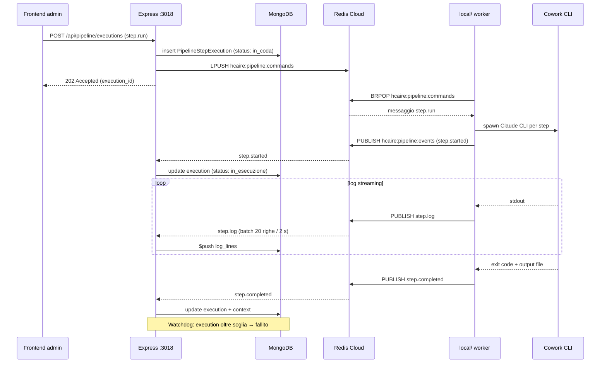

# Backend

Architettura del workspace `server/`. Riferimento principale: `server/src/index.ts` (entry point unico).

## 1. Bootstrap

```
loadEnv (dotenv.config)           ← DEVE essere il primo import
  ↓
import modulari (routes, services, middleware)
  ↓
app = express()
  ↓
app.get('/health', ...)           ← prima di qualsiasi middleware
  ↓
cors({ origin: CORS_ORIGIN })
  ↓
app.use('/webhooks', ...)         ← PRIMA di express.json (raw body)
  ↓
clerkMiddleware()                 ← popola auth su tutte le richieste successive
  ↓
express.json({ limit: '10mb' })
  ↓
mount routes /api/*
  ↓
app.listen(PORT)
  ↓
connectDB().then(() => start background services)
```

L'ordine non è negoziabile. Sezioni critiche:

1. **`loadEnv` per primo**: `dotenv.config()` dentro `loadEnv.ts` importato prima di tutto. Molti moduli leggono `process.env` al load time (`config/redis.ts`, `config/db.ts`, R2 client, Telegraf, Clerk).
2. **`/webhooks` prima di `express.json()`**: il webhook Lemon Squeezy verifica una firma HMAC SHA256 sul body grezzo. Dopo `express.json()` la firma non è più verificabile.
3. **`clerkMiddleware()` globale**: applicato prima delle route `/api/*`. Le route protette aggiungono `requireAuth` o `requireAdmin`; le pubbliche possono usare `optionalClerkAuth` per leggere `userId` senza bloccare.

## 2. Health check

```ts
app.get('/health', (_req, res) => {
  const dbState = mongoose.connection.readyState;
  res.json({ status: 'ok', db: dbState === 1 ? 'connected' : 'connecting', timestamp: ... });
});
```

Posizionato prima di CORS, Clerk e parser. Risponde anche con DB in `connecting` (`readyState === 2`).

## 3. Mount delle routes

23 file in `server/src/routes/`, mount centralizzato in `index.ts`:

| Mount | File | Auth |
|-------|------|------|
| `/webhooks` | `webhooks.ts` | Firma HMAC (Lemon Squeezy) |
| `/api/contents` | `content.ts` | Pubblico / `optionalClerkAuth` / `requireAdmin`; `POST /import` API key |
| `/api/navigation` | `nav.ts` | Pubblico; modifie admin |
| `/api/article-requests` | `articleRequests.ts` | POST pubblico; admin GET/DELETE |
| `/api/subscriptions` | `subscriptions.ts` | `requireAuth` su `/status`; webhook secret |
| `/api/site-config` | `siteConfig.ts` | Pubblico (GET); admin (PUT) |
| `/api/site-content` | `siteContent.ts` (public) | Pubblico |
| `/api/admin/site-content` | `siteContent.ts` (admin) | `requireAdmin` |
| `/api/hcaire` | `hcaire.ts` | Pubblico (GET); admin (modifie) |
| `/api/metodo` | `metodo.ts` | idem |
| `/api/sviluppo-bambino` | `sviluppoBambino.ts` | idem |
| `/api/assi` | `assi.ts` | admin |
| `/api/admin/assi-chapters` | `assiChapters.ts` | admin |
| `/api/admin/catalog/{authors,books}` | `catalogAuthors.ts`, `catalogBooks.ts` | Pubblico (GET); admin (modifie con upload R2) |
| `/api/bartleby` | `bartleby.ts` | Pubblico (GET KB); API key o admin (POST trace) |
| `/api/letture` | `letture.ts` | Pubblico |
| `/api/admin/letture` | `letture.ts` (admin) | `requireAdmin` (incluso `POST .../steps/:step_id/run`) |
| `/api/pipeline` | `pipeline.ts` | Pubblico (GET); admin (modifie) |
| `/api/archivio/temi` | `archivioTemi.ts` | Pubblico (GET); admin (modifie) |
| `/api/admin/skills` | `skills.ts` | admin |
| `/api/admin/plugins` | `plugins.ts` | admin |
| `/api/admin/job-definitions` | `jobDefinitions.ts` | admin |
| `/api/admin/job-requests` | `jobRequests.ts` | admin |
| `/api` | `auth.ts` (legacy) | **Dead code** — vedi [Autenticazione](./autenticazione.md) |

Per la mappa completa lato FE → BE vedi [Routing](./routing.md).

## 4. Servizi di background

Avviati dopo `connectDB()`, ciascuno in `try/catch` indipendente: il fallimento di uno **non** impedisce gli altri.

```ts
connectDB().then(() => {
  try { startTelegramBot(); } catch (err) { /* log */ }
  try { startPipelineEventSubscriber(); startPipelineWatchdog(); } catch (err) { /* log */ }
  try { startLettureEventSubscriber(); startLettureWatchdog(); } catch (err) { /* log */ }
  try { startAssiEventSubscriber(); } catch (err) { /* log */ }
  try { startBartlebyTraceSubscriber(); } catch (err) { /* log */ }
});
```

| Servizio | File | Cosa fa |
|----------|------|---------|
| `startTelegramBot` | `services/telegramBot.ts` | Avvia bot Telegraf (`TELEGRAM_TOKEN` + `TELEGRAM_ID`). Pattern `genera articoli` per spawn Cowork CLI in `COWORK_PROJECT_PATH`. Append tracce a `COWORK_FILE_ARTICOLO`. |
| `startPipelineEventSubscriber` | `services/pipelineEventSubscriber.ts` | `SUBSCRIBE` su `pipeline:step:execution:complete`. Aggiorna `PipelineStepExecution` + `PipelineContext`. Throttling log (20 righe / 2 s). |
| `startPipelineWatchdog` | idem | `setInterval` `PIPELINE_WATCHDOG_INTERVAL_MS`: marca timed-out le execution oltre `PIPELINE_DEFAULT_TIMEOUT_MS`. |
| `startLettureEventSubscriber` + watchdog | `services/lettureEventSubscriber.ts` | Speculare per letture (Opera.steps[]). |
| `startAssiEventSubscriber` | `services/assiEventSubscriber.ts` | Reagisce a eventi rebuild assi (importazione/normalizzazione da archivio FS). |
| Bartleby trace subscriber | `services/messageBus.ts` (`CHANNEL_BARTLEBY_TRACE_NEW`) | Riceve nuove `InputTrace` per generazione output. |

## 5. Bus Redis

`services/messageBus.ts` definisce le costanti dei canali:

| Canale / Lista | Direzione | Scopo |
|----------------|-----------|-------|
| `CHANNEL_ARTICLE_NEW` (`article:new`) | server → local | Nuovo `ArticleRequest` Telegram |
| `CHANNEL_BARTLEBY_TRACE_NEW` (`bartleby:trace:new`) | server → local | Nuova `InputTrace` Bartleby |
| `hcaire:pipeline:commands` (lista) | server → local | `step.run`, `step.cancel`, `step.ping` |
| `hcaire:pipeline:events` (pub/sub) | local → server | Esito step pipeline (started/log/completed/failed/cancelled) |
| `hcaire:letture:commands`, `hcaire:letture:events` | bidirezionale | Pipeline letture |
| `hcaire:assi:rebuild:commands`, `hcaire:assi:rebuild:events` | bidirezionale | Rebuild assi |

Pattern ioredis: **pub** via `getRedisClient()` singleton; **sub** via `pub.duplicate({ lazyConnect: false })` (Redis richiede connessione separata per i subscriber).

### Throttling log pipeline

`pipelineEventSubscriber.handleLog` bufferizza per execution, flush a 20 righe o 2 s di idle. Lo `$push` su `log_lines` di `PipelineStepExecution` è batched.

### Trigger F2 → F3 (bridge ambiti)

A `pipeline.step.completed` per `f3_step_6` (ultimo step F2) il subscriber popola atomicamente, nello stesso `$set` Mongo, un `pending_decision` di tipo `f2_to_f3_tema_selection` sulla ricerca. Le opzioni provengono dall'output di `f2_step_5` verificato. La scrittura atomica garantisce no-race lato frontend: al primo polling dopo il completamento, FE vede contemporaneamente lo step `completato` e il banner di decisione.

Vedi [Produzioni — Bridge ambiti](../20-modules/sviluppo-bambino/produzioni.md) per il modello dati `tema_ambiti` e gli endpoint del bridge.

### Watchdog

Soglia: `PIPELINE_DEFAULT_TIMEOUT_MS + PIPELINE_WATCHDOG_GRACE_MS` (default 600 s + 60 s).

```js
PipelineStepExecution.find({
  status: { $in: ['in_coda', 'in_esecuzione'] },
  $or: [
    { started_at: { $lt: threshold } },
    { started_at: null, created_at: { $lt: threshold } },
  ],
})
```

Le execution scadute passano a `fallito` con `error.source: 'timeout'` e propagano su `PipelineContext`.

## 6. Flusso eventi pipeline (FE ↔ BE ↔ Mongo ↔ Redis ↔ Cowork)



## 7. Persistenza

`config/db.ts` espone `connectDB()`:

```ts
const mongoUrl = urlTemplate
  .replace('{password}', password)
  .replace('/?', '/hcaire_db?');
await mongoose.connect(mongoUrl);
```

`MONGODB_URL` arriva con `{password}` come placeholder e senza database name. Il codice li inietta prima della connessione. Modelli e collection in [Database](./database.md).

## 8. Gestione errori

Pattern non uniforme:

- Controller con `try/catch` esplicito → `res.status(N).json({ error: '...' })`.
- Middleware che rispondono direttamente con `res.status(...)` e `return`.
- Background services con `try/catch` di startup + log `console.error`.

**Non c'è** un error handler Express globale. Eccezioni async non gestite finiscono nel listener `unhandledRejection` di Node.

## 9. Variabili d'ambiente critiche

Vedi [Inventario §6](../00-overview/inventario.md#6-variabili-dambiente-server). All'avvio vengono loggate:

```ts
['MONGODB_PASSWORD', 'MONGODB_URL', 'CLERK_SECRET_KEY']
  .forEach((v) => console.log(`[Env] ${v}: ${process.env[v] ? 'SET' : 'MISSING'}`));
```

Senza una di queste l'app si avvia ma fallisce alla prima richiesta autenticata o al primo accesso DB (`connectDB` chiama `process.exit(1)` su errore).
