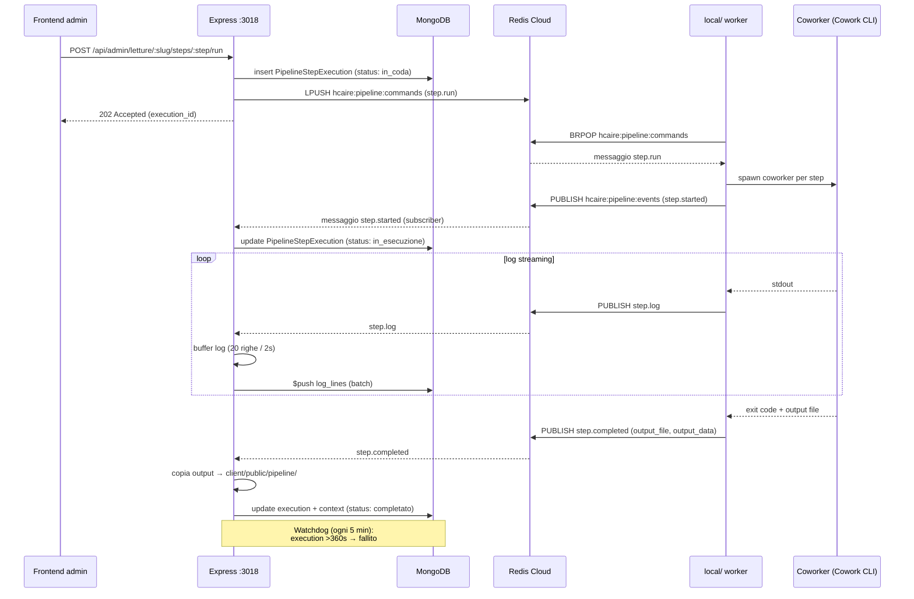

# Backend

Architettura del workspace `server/`. Riferimento principale: `server/src/index.ts` (entry point unico).

## 1. Bootstrap

```
loadEnv (dotenv.config)        ← DEVE essere il primo import
  ↓
imports modulari (routes, services, middleware)
  ↓
app = express()
  ↓
app.get('/health', ...)        ← prima di qualsiasi middleware
  ↓
cors({ origin: CORS_ORIGIN })
  ↓
app.use('/webhooks', ...)      ← PRIMA di express.json (raw body)
  ↓
clerkMiddleware()              ← popola auth su tutte le richieste successive
  ↓
express.json({ limit: '10mb' })
  ↓
mount routes /api/*
  ↓
app.listen(PORT)
  ↓
connectDB().then(start background services)
```

L'ordine non è negoziabile e ha tre sezioni critiche:

1. **`loadEnv` per primo**: `dotenv.config()` viene chiamato dentro `loadEnv.ts` importato per primissimo da `index.ts`. Serve perché molti moduli (es. `config/redis.ts`) leggono `process.env` al loro module-load time.
2. **`/webhooks` prima di `express.json()`**: il webhook Lemon Squeezy verifica una firma HMAC SHA256 sul body grezzo. Una volta che `express.json` parsa il body, la firma non è più verificabile.
3. **`clerkMiddleware()` globale**: applicato a tutte le route `/api/*`. Le route protette usano poi `requireAuth` o `requireAdmin` da `middleware/clerkAuth.ts`. Le route pubbliche usano `optionalClerkAuth` per leggere `userId` senza bloccare.

## 2. Health check

```ts
app.get('/health', (_req, res) => {
  const dbState = mongoose.connection.readyState;
  res.json({ status: 'ok', db: dbState === 1 ? 'connected' : 'connecting', timestamp: ... });
});
```

Posizionato **prima** di CORS, Clerk e parser. Risponde anche quando la connessione DB è in stato `connecting` (`readyState === 2`).

## 3. Mount delle routes

| Mount | File | Auth |
|-------|------|------|
| `/webhooks` | `routes/webhooks.ts` | Firma HMAC SHA256 (Lemon Squeezy) |
| `/api/contents` | `routes/content.ts` | Mix: pubblico, `optionalClerkAuth`, `requireAdmin`, `authenticateApiKey` per `/import` |
| `/api/navigation` | `routes/nav.ts` | Pubblico |
| `/api/article-requests` | `routes/articleRequests.ts` | Pubblico (POST), admin (GET) |
| `/api/subscriptions` | `routes/subscriptions.ts` | `requireAuth` |
| `/api/site-config` | `routes/siteConfig.ts` | Pubblico (GET), admin (PUT) |
| `/api/site-content` | `routes/siteContent.ts` (`siteContentPublicRouter`) | Pubblico |
| `/api/admin/site-content` | `routes/siteContent.ts` (`siteContentAdminRouter`) | `requireAdmin` |
| `/api/bartleby` | `routes/bartleby.ts` | Mix (fuori scope) |
| `/api/hcaire` | `routes/hcaire.ts` | Pubblico |
| `/api/sviluppo-bambino` | `routes/sviluppoBambino.ts` | Pubblico (~22 endpoint) |
| `/api/pipeline` | `routes/pipeline.ts` | Mix |
| `/api/letture` | `routes/letture.ts` | Pubblico |
| `/api/admin/letture` | `routes/letture.ts` (`lettureAdminRouter`) | `requireAdmin` (incluso `POST .../steps/:step_id/run`) |
| `/api` | `routes/auth.ts` (legacy) | **Dead code** — vedi [Autenticazione §6](./autenticazione.md#residui-legacy) |

Vedi [Routing](./routing.md) per la mappa estesa.

## 4. Servizi di background

Avviati dopo `connectDB()`, ciascuno in un blocco `try/catch` indipendente: il fallimento di uno **non** impedisce l'avvio degli altri.

```ts
connectDB().then(() => {
  try { startTelegramBot(); } catch (err) { ... }
  try { startPipelineEventSubscriber(); startPipelineWatchdog(); } catch (err) { ... }
  try { startLettureEventSubscriber(); startLettureWatchdog(); } catch (err) { ... }
});
```

| Servizio | File | Cosa fa |
|----------|------|---------|
| `startTelegramBot` | `services/telegramBot.ts` | Avvia bot Telegraf, comandi |
| `startPipelineEventSubscriber` | `services/pipelineEventSubscriber.ts` | `SUBSCRIBE` su `hcaire:pipeline:events`, aggiorna `PipelineStepExecution` e `PipelineContext` |
| `startPipelineWatchdog` | idem | `setInterval` ogni `PIPELINE_WATCHDOG_INTERVAL_MS` (default 5 min): marca come `fallito` le execution rimaste `in_coda`/`in_esecuzione` oltre soglia |
| `startLettureEventSubscriber` | `services/lettureEventSubscriber.ts` | Speculare per letture |
| `startLettureWatchdog` | idem | Speculare |

## 5. Bus Redis pipeline

`services/messageBus.ts` definisce il protocollo `PipelineMessageBus`:

| Direzione | Operazione | Chiave/Canale | Scopo |
|-----------|------------|---------------|-------|
| Server → Worker | `LPUSH` | `hcaire:pipeline:commands` | `step.run`, `step.cancel`, `step.ping` |
| Worker → Server | `PUBLISH` | `hcaire:pipeline:events` | `step.started`, `step.log`, `step.completed`, `step.failed`, `step.cancelled`, `step.pong` |

Pattern ioredis usato:

- **pub** → client condiviso da `getRedisClient()` (lazy connect).
- **sub** → `pub.duplicate({ lazyConnect: false })` perché Redis richiede una connessione separata per i subscriber.

Speculare in `services/lettureMessageBus.ts` su `hcaire:letture:*`.

### Throttling dei log

`pipelineEventSubscriber.handleLog` non scrive su MongoDB ad ogni messaggio. Usa un buffer per execution con flush a:

- 20 righe accumulate (`FLUSH_AFTER_LINES`), oppure
- 2 secondi dall'ultima riga (`FLUSH_AFTER_MS`).

Lo `$push` su `log_lines` di `PipelineStepExecution` è quindi batched.

### Trigger F2 → F3 (bridge ambiti)

Quando arriva un `pipeline.step.completed` per `f3_step_6` con stato `completato` — ultimo step della sequenza lineare F2 — il subscriber popola atomicamente nello stesso `$set` Mongo un `pending_decision` di tipo `f2_to_f3_tema_selection` sulla ricerca. Le opzioni sono lette dall'output di `f2_step_5` verificato. La scrittura atomica garantisce che il polling del frontend, alla prima fetch dopo il completamento, veda contemporaneamente lo step `completato` e il banner di decisione (no race window).

Vedi [Produzioni §3.1](../20-modules/sviluppo-bambino/produzioni.md#31-bridge-f2--f3-ad-ambiti-1n-tema--dispositivi) per il modello dati `tema_ambiti` e gli endpoint del bridge.

> **Modificato in v3.0 (D7-pipeline-f3-redesign, 2026-05-06)**: nelle versioni precedenti il subscriber gestiva un override post-verifica di `f3_step_6b` (`applyOverrideStep6b` impostava `overrides_applied.step_6b_proxy = true`). Nel modello F3 ridotto a 5 step `f3_step_6b` non esiste più — il dispositivo è prodotto e finalizzato lungo `2 → 3 → 4` senza sostituzioni ex post. Il branch è stato rimosso.

### Watchdog

Soglia: `PIPELINE_DEFAULT_TIMEOUT_MS + PIPELINE_WATCHDOG_GRACE_MS` (default 300s + 60s = 360s).

Ogni tick:

```js
PipelineStepExecution.find({
  status: { $in: ['in_coda', 'in_esecuzione'] },
  $or: [
    { started_at: { $lt: threshold } },
    { started_at: null, created_at: { $lt: threshold } },
  ],
})
```

Le execution scadute passano a `fallito` con `error.source: 'timeout'` e propagazione su `PipelineContext`.

## 6. Flusso eventi pipeline (FE ↔ BE ↔ Mongo ↔ Redis)



## 7. Persistenza

`config/db.ts` espone `connectDB()`:

```ts
const mongoUrl = urlTemplate
  .replace('{password}', password)
  .replace('/?', '/hcaire_db?');
await mongoose.connect(mongoUrl);
```

`MONGODB_URL` arriva con `{password}` come placeholder e senza database name (`mongodb+srv://.../?...`). Il codice li inietta entrambi prima della connessione. Vedi [Database](./database.md) per modelli e collection.

## 8. Gestione errori

Pattern non uniforme. Tre approcci coesistenti:

- Controller con `try/catch` esplicito che ritorna `res.status(N).json({ error: '...' })`.
- Middleware (es. `requireAdmin`) che chiamano direttamente `res.status(...)` e `return` senza `next(err)`.
- Background services con `try/catch` di startup e logging via `console.error`.

**Non c'è** un error handler Express globale (`app.use((err, req, res, next) => ...)`). Eventuali eccezioni async non gestite finiscono nel listener `unhandledRejection` di Node.

## 9. Variabili d'ambiente critiche

Vedi [Inventario §7](../00-overview/inventario.md#7-variabili-dambiente). Le tre verificate esplicitamente all'avvio:

```ts
['MONGODB_PASSWORD', 'MONGODB_URL', 'CLERK_SECRET_KEY']
  .forEach((v) => console.log(`[Env] ${v}: ${process.env[v] ? 'SET' : 'MISSING'}`));
```

Senza una di queste l'app si avvia ma fallisce alla prima richiesta autenticata o al primo accesso DB (`connectDB` chiama `process.exit(1)` su errore).
