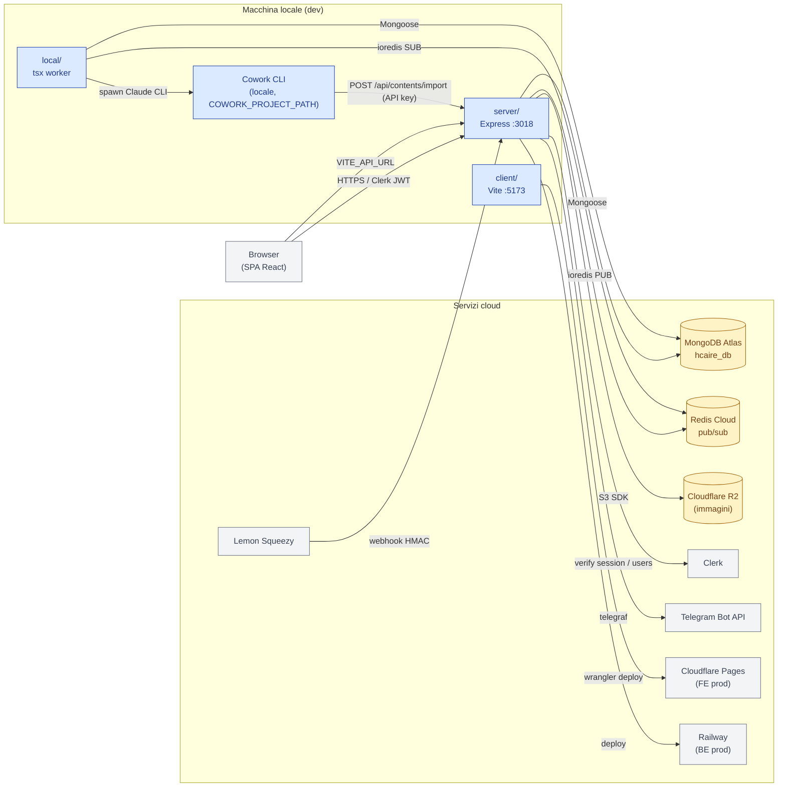

# Stack tecnologico

Sintesi delle tecnologie effettivamente in uso nel monorepo `hcaire`, con versioni dai `package.json` di ciascun workspace.

## 1. Workspace e processi

`hcaire/package.json` definisce tre workspace npm:

| Workspace | Tipo processo | Avvio dev | Build | Note |
|-----------|---------------|-----------|-------|------|
| `server/` | Express HTTP + background services | `nodemon ts-node` | `tsc` | Porta `3018` |
| `client/` | Vite SPA | `vite` (porta `5173`) | `tsc && vite build` | Deploy via `wrangler` |
| `local/` | Worker `tsx watch` | `tsx watch src/index.ts` | `tsc` | Bridge Cowork CLI + subscriber Redis |

`npm run dev` lancia i tre processi in parallelo via `concurrently`.

## 2. Server (`server/`)

| Categoria | Pacchetto | Versione | Ruolo |
|-----------|-----------|----------|-------|
| Runtime | Node.js | ≥ 18 | Testato con Node 24 / npm 11 |
| HTTP | `express` | ^4.18 | Framework |
| HTTP | `cors` | ^2.8 | CORS |
| Auth | `@clerk/express` | ^2.1 | Middleware Clerk + `requireAuth` |
| Auth | `@clerk/backend` | ^3.2 | Client SDK per `users.getUser` |
| Auth (legacy) | `jsonwebtoken` | ^9.0 | JWT residuo, dead code |
| ODM | `mongoose` | ^8.1 | MongoDB |
| Pub/sub | `ioredis` | ^5.10 | Redis Cloud client |
| Bot | `telegraf` | ^4.16 | Telegram bot |
| Storage | `@aws-sdk/client-s3` | ^3.10 | Cloudflare R2 (immagini catalogo) |
| Upload | `multer` | ^2.1 | Multipart upload (admin catalogo) |
| Validation | `ajv` | ^8.20 | JSON Schema (letture, pipeline step config) |
| Markdown | `gray-matter` | ^4.0 | Frontmatter parsing |
| Slugify | `github-slugger` | ^2.0 | Slug capitoli / sezioni |
| Mime | `mime-types` | ^2.1 | Detection mime upload |
| Env | `dotenv` | ^16.4 | Caricato per primo da `loadEnv.ts` |
| Tooling | `typescript` | ^5.3 | |
| Tooling | `nodemon`, `ts-node` | ^3 / ^10 | Dev only |

## 3. Client (`client/`)

| Categoria | Pacchetto | Versione | Ruolo |
|-----------|-----------|----------|-------|
| UI | `react` / `react-dom` | ^18.2 | |
| Routing | `react-router-dom` | ^6.21 | `BrowserRouter` |
| Auth | `@clerk/clerk-react` | ^5.61 | `ClerkProvider`, `useUser`, `useAuth` |
| State / cache | `@tanstack/react-query` | ^5.10 | Query, mutation, SSE wrapper |
| Styling | `tailwindcss` | ^3.4 | Default per pagine |
| UI Kit | `@mui/material` + `@emotion/*` | ^5.15 | Componenti complessi (Dialog, TextField, ecc.) |
| UI Kit | `@mui/icons-material` | ^5.15 | Icone |
| Markdown | `react-markdown` | ^9.0 | Rendering articoli + capitoli |
| Markdown | `remark-gfm` | ^4.0 | Tabelle, task list |
| Markdown | `remark-footnotes` | ^4.0 | Note a piè di pagina |
| Markdown | `rehype-raw`, `rehype-slug`, `rehype-autolink-headings` | ^7 / ^6 / ^7 | HTML inline + anchor link |
| Build | `vite` | ^8.0 | Dev server + build |
| Build | `@vitejs/plugin-react` | ^6.0 | Fast Refresh |
| Deploy | `@cloudflare/vite-plugin` | ^1.31 | Integrazione Cloudflare |
| Deploy | `wrangler` | ^4.81 | CLI Cloudflare (`deploy`, `preview`) |
| Tooling | `tailwindcss`, `postcss`, `autoprefixer` | latest 3.x | Pipeline CSS |

Script principali:

- `npm run dev` — Vite su `http://localhost:5173`, proxy `/api → http://localhost:3018`.
- `npm run build` — type-check (`tsc`) + bundle Vite.
- `npm run preview` — build + `wrangler dev`.
- `npm run deploy` — build + `wrangler deploy`.

## 4. Local sidecar (`local/`)

Worker `tsx watch`, dipendenze ridotte all'essenziale:

| Pacchetto | Versione | Ruolo |
|-----------|----------|-------|
| `ioredis` | ^5.3 | Subscriber Redis (`article:new`, `bartleby:trace:new`, `pipeline:step:execution:complete`, `letture:*`, `assi:*`) |
| `mongoose` | ^8.1 | Aggiornamento collection `workflow_logs`, `bartleby_input_traces`, `pipeline_step_executions`, ecc. |
| `ajv` | ^8.20 | Validazione schemi |
| `tsx` | ^4.7 | Esecutore TS in modalità watch |

Script utility:

| Script | Cosa fa |
|--------|---------|
| `seed:test-ricerca` | Seed di una ricerca F2 di test |
| `backfill:outputs` | Backfill output di step già eseguiti |
| `inherit:f2-steps` | Propaga step F2 a temi figli |
| `test:assi-rebuild` | Trigger rebuild assi |

## 5. Servizi esterni

| Servizio | Provider | Uso |
|----------|----------|-----|
| **MongoDB Atlas** | Cluster `cluster0.y3qtgdm.mongodb.net`, db `hcaire_db` | Persistenza |
| **Redis Cloud** | GCP `eu-west3` | Pub/sub eventi |
| **Clerk** | SaaS | Identità, sessioni, ruoli |
| **Lemon Squeezy** | SaaS | Billing, webhook HMAC SHA256, 3 varianti piano |
| **Telegram** | Bot API | Listener trace articoli + comandi `genera` |
| **Cloudflare R2** | Object storage | Immagini catalogo (autori/libri) |
| **Cloudflare Pages** | Static hosting | Deploy frontend |
| **Railway** | PaaS | Hosting server Express |
| **Cowork CLI** | Locale (sulla macchina dello sviluppatore) | Generazione articoli + step pesanti |

Vedi [Inventario §6-7](../00-overview/inventario.md#6-variabili-dambiente-server) per le variabili d'ambiente.

## 6. Mappa di sistema



## 7. Test

`node --test` nativo, niente Jest/Vitest:

```
npm run test                     # i tre suite
npm run test:pipeline-config     # scripts/test-pipeline-step-config.mjs
npm run test:pipeline-mapper     # services/__tests__/pipelineMappers.test.ts
npm run test:pipeline-enablement # services/__tests__/stepEnablement.test.ts
```

Usano `--experimental-strip-types` per girare TS senza compilazione.

## 8. Vincoli

- **Node ≥ 18** (testato con 24).
- **Single tenant**: gli admin sono identificati per `publicMetadata.role`.
- **`CONTENT_BASE_PATH`** (fallback FS): se vuoto, le sezioni HCAIRE/Metodo/Sviluppo Bambino usano solo `SiteContent` da MongoDB.
- **Cowork CLI è locale**: non può girare su Railway / Cloudflare; per questo il worker `local/` è "portatile" sulla macchina che lancia la generazione.
