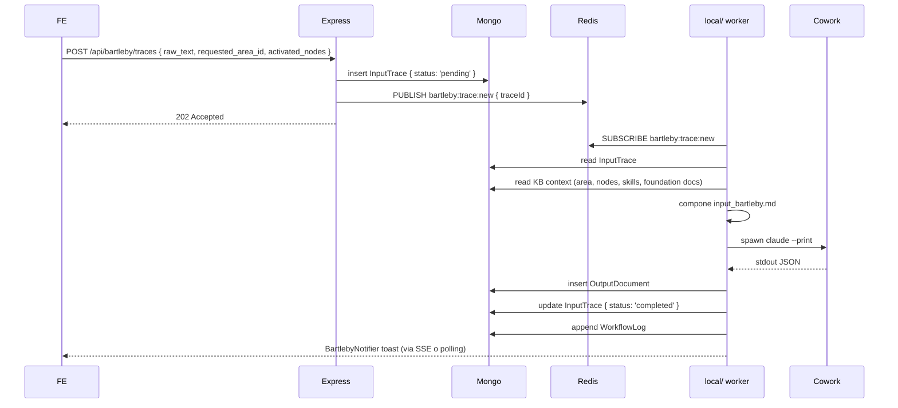

# Modulo Bartleby

Scheda funzionale di **Bartleby**: knowledge base + console + output documents, accessibile sotto `/bartleby/*`. Gli utenti con piano `bartleby` o `bartleby_plus` accedono alle aree avanzate; il resto è pubblico in lettura.

## 1. Scopo

Bartleby è uno strumento di **ricerca assistita** che combina:

- una **knowledge base strutturata** (concept node, domain area, foundation document, skill, area sheet);
- una **console** dove un utente autenticato sottomette una "trace" (input testuale + selezioni KB) per generare output;
- un repository di **output documents** pubblicabili (visibili anche a utenti non Bartleby).

L'esecuzione di una trace passa dal worker `local/` che spawna Cowork (Claude Code CLI). Vedi [Local — ponte Cowork](../10-architecture/local-cowork-bridge.md).

## 2. Aree

| Area | URL FE | Endpoint BE |
|------|--------|-------------|
| Landing | `/bartleby` | (statica) |
| Console | `/bartleby/console` | `POST /api/bartleby/traces` (submission) |
| Knowledge Base | `/bartleby/knowledge-base[/:section[/:itemId]]` | `GET /api/bartleby/{concept-nodes,domain-areas,foundation-documents,area-sheets,skills,output-templates}` |
| Output documents (lista) | `/bartleby/outputs` | `GET /api/bartleby/output-documents` |
| Output document (detail) | `/bartleby/outputs/:id` | `GET /api/bartleby/output-documents/:id` |

## 3. Modello dati (KB)

Tutti i modelli vivono in `server/src/models/bartleby/` con prefisso `bartleby_*` come nome collection. Tutti hanno un campo `bartlebyId` unique.

| Entità | Campi chiave |
|--------|--------------|
| `ConceptNode` | `name`, `slug`, `description`, `priority_level`, `source_context` |
| `DomainArea` | `name`, `slug`, `description`, `research_focus[]`, `access_points[]` |
| `FoundationDocument` | `title`, `slug`, `raw_text`, `structural_refs`, `reading_focus[]`, `interpretive_warnings[]`, `observability_requirements[]`, `non_classificability_rules[]` |
| `AreaSheet` | `domain_area_id`, `title`, `description`, `structure_depth`, `protocol_notes` |
| `Skill` (Bartleby) | `name`, `slug`, `skill_type` (`research`/`synthesis`/`application`), `description`, `input_spec`, `output_spec`, `activation_context`, `instruction_payload` |
| `OutputTemplate` | `name`, `output_type`, `prompt_instructions`, `structure_spec`, `example_output` |

Bridge tables (many-to-many):

- `FoundationDocumentNode` (doc ↔ node)
- `AreaSheetNode` (area ↔ node)
- `SkillNode` (skill ↔ node)
- `SkillArea` (skill ↔ area)

## 4. Modello dati (operativo)

| Entità | Campi chiave |
|--------|--------------|
| `InputTrace` | `corpus_id`, `user_id`, `title`, `raw_text`, `context_notes`, `target_output_type`, `requested_area_id`, `activated_nodes[]`, `trace_type`, `status` (`pending`/`processing`/`completed`/`failed`) |
| `OutputDocument` | `title`, `output_type`, `audience`, `activated_nodes[]`, `structured_output`, `created_at` (visibilità pubblica governata da campo dedicato) |

## 5. File coinvolti

### Backend

| File | Ruolo |
|------|-------|
| `server/src/models/bartleby/*.ts` | Tutti i modelli Bartleby |
| `server/src/routes/bartleby.ts` | Route mounted su `/api/bartleby` |
| `server/src/controllers/bartlebyController.ts` | KB queries (concept → area sheets/skills/output, area → priority nodes, skill → nodes/areas) + submission trace + log |
| `server/src/services/messageBus.ts` | Pub/sub `CHANNEL_BARTLEBY_TRACE_NEW` (`bartleby:trace:new`) |
| `server/src/data/bartleby/seed/*.json` | Dump iniziale KB |
| `server/src/scripts/seedBartleby.ts` | Seed da JSON → Mongo |

### Worker locale

| File | Ruolo |
|------|-------|
| `local/src/bartlebyWorker.ts` | `processBartlebyTrace(payload)`: leggi trace, compone prompt, spawna Cowork, parsa output JSON, salva `OutputDocument`, append `WorkflowLog` |

### Frontend

| File | Ruolo |
|------|-------|
| `pages/bartleby/BartlebyLanding.tsx` | Landing pubblica |
| `pages/bartleby/BartlebyHome.tsx` | Console principale |
| `pages/bartleby/KnowledgeBase.tsx` (lazy) | Viewer KB (sezioni concept-nodes, domain-areas, skills, foundation-documents) |
| `pages/bartleby/OutputList.tsx` | Lista output pubblici |
| `pages/bartleby/OutputDetail.tsx` | Singolo output |
| `components/bartleby/BartlebyNav.tsx` | Sotto-nav |
| `components/bartleby/BartlebyNotifier.tsx` | Toast notifiche (sottoscrive eventi server-pushed: nuove trace, output pronti) |
| `components/bartleby/ProvenancePanel.tsx` | Viewer provenienza output (source nodes/areas/skills attivate) |
| `components/bartleby/TraceForm.tsx` | Form submission trace |
| `services/bartlebyService.ts` | Wrapper fetch |
| `types/bartleby.ts` | Tipi |

## 6. Rotte BE

### Pubbliche / KB read

| Verb | Path | Funzione |
|------|------|----------|
| `GET` | `/api/bartleby/concept-nodes` | Lista concept nodes |
| `GET` | `/api/bartleby/concept-nodes/:id` | Dettaglio (con related area sheets, skills, output docs) |
| `GET` | `/api/bartleby/domain-areas` | Lista domain areas |
| `GET` | `/api/bartleby/domain-areas/:id` | Dettaglio + priority nodes |
| `GET` | `/api/bartleby/foundation-documents[/...]` | Lista / dettaglio |
| `GET` | `/api/bartleby/area-sheets[/...]` | Lista / dettaglio |
| `GET` | `/api/bartleby/skills[/...]` | Lista / dettaglio + related nodes/areas |
| `GET` | `/api/bartleby/output-templates[/...]` | Lista / dettaglio |
| `GET` | `/api/bartleby/output-documents[/...]` | Lista output pubblici |

### Operative

| Verb | Path | Auth | Funzione |
|------|------|------|----------|
| `POST` | `/api/bartleby/traces` | API key Cowork **o** Clerk (utente con piano Bartleby) | Submission trace → publish `bartleby:trace:new` |
| `POST` | `/api/bartleby/output-documents` | API key Cowork (dal worker) | Inserisce output prodotto da Cowork |

## 7. Flusso submission trace

## 8. Componenti UI

### `KnowledgeBase` (lazy)

Viewer multi-tab della KB. Sidebar: sezioni (Concept nodes / Domain areas / Foundation documents / Skills / Output templates). Pannello centrale: lista items con search. Pannello destro: dettaglio item selezionato + bridge tables popolate (area sheets correlate, skills correlate, ecc.).

### `BartlebyHome` (console)

`TraceForm`:

- Titolo trace
- Testo libero (raw_text)
- Context notes
- Selezione area di riferimento
- Selezione nodes da attivare
- Tipo output desiderato
- Audience target

Submit → `POST /api/bartleby/traces`. Dopo l'invio, polling stato trace + toast notifier al completamento.

### `OutputList` / `OutputDetail`

Output documents pubblici (filtro: `is_public: true` o equivalente). `OutputDetail` mostra il `structured_output` con `ProvenancePanel` (source nodes, area, skills attivate).

### `BartlebyNotifier`

Sempre montato in `AppLayout`. Sottoscrive un canale di notifiche (SSE o polling) per tracking trace dell'utente loggato. Toast quando una trace completa.

## 9. Dipendenze

- **MongoDB** (collections `bartleby_*`).
- **Redis Cloud** (`bartleby:trace:new`).
- **Worker `local/`** (`bartlebyWorker.ts`) per esecuzione Cowork.
- **Clerk** per autenticazione + verifica piano (`bartleby` / `bartleby_plus`).
- **API key Cowork** per submission da agenti esterni.

## 10. Gating piani

- **`bartleby`**: accesso a KB completa, submission trace, viewer output.
- **`bartleby_plus`**: aggiunge funzionalità avanzate (es. visibilità a tutti gli output incluso quelli privati di altri utenti? — da confermare nella implementazione).
- **Free / non-piano**: solo `/bartleby` landing + `/bartleby/outputs` (output marcati pubblici).

Gating FE via `useSubscription().isBartleby` / `isBartlebyPlus`. Gating BE via `requireAuth` + verifica `UserSubscription`.

## 11. Criticità note

- **API key statica** per submission trace (uso Cowork): vedi [Autenticazione](./autenticazione.md).
- **Output prodotti asincronamente**: latenza variabile in base alla coda Redis e al carico Cowork. Il `BartlebyNotifier` può non chiudere il loop se SSE non è implementato (verificare lato implementazione).
- **KB seed iniziale**: il modello è denso (concept nodes + domain areas + foundation documents + bridge tables); modifiche manuali post-seed devono mantenere coerenza dei bridge.
- **Niente UI admin dedicata** per KB: oggi si modifica via mongosh o via API admin diretta.

## 12. Test

Niente test automatici. Verifiche manuali:

- Submission trace come utente Bartleby → toast al completamento + presenza in OutputList se pubblicato.
- Navigazione KB: concept node → related area sheets/skills/outputs.
- Gating: utente non-Bartleby tenta `POST /api/bartleby/traces` → 403.
