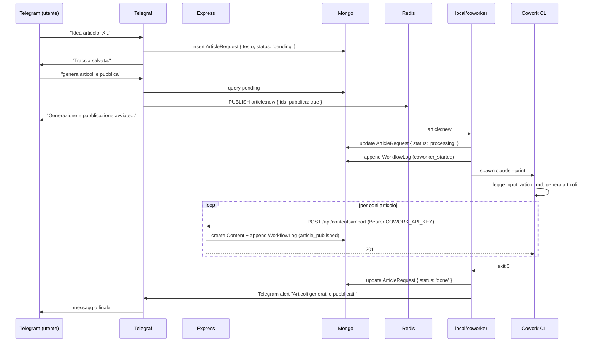

# Modulo Integrazione Telegram + Cowork

Scheda funzionale del **workflow Zero-Touch** per generare e pubblicare articoli sul blog tramite messaggi Telegram, che attivano la **Cowork CLI** locale. Copre le feature FEAT-001 → FEAT-004 di `FEATURES.md`.

## 1. Scopo

Permettere al proprietario (singolo utente autorizzato Telegram) di:

1. Inviare via Telegram una "traccia" testuale di un articolo → salvata come `ArticleRequest`.
2. Inviare un comando "genera articoli" → spawn della Cowork CLI in background che genera gli articoli a partire dalle tracce accumulate.
3. Aggiungere "e pubblica" al comando → Cowork pubblica direttamente sul blog via `POST /api/contents/import` (API key).
4. Importare articoli generati da Cowork manualmente via dashboard admin (cartella `articolo.md` + `metadata.json`).

L'obiettivo è **ridurre l'attrito di pubblicazione** a un solo messaggio per la traccia + un solo messaggio per la generazione/pubblicazione.

## 2. Architettura

```
Telegram → Bot (Telegraf) → Mongo (ArticleRequest) → Redis (article:new) → local/coworker.ts → Cowork CLI → POST /api/contents/import (API key) → Mongo (Content)
                                                                                                     │
                                                                                                     └─ append WorkflowLog
```

Vedi [Local — ponte Cowork](../10-architecture/local-cowork-bridge.md) per il dettaglio del ponte locale.

## 3. Componenti

### Telegram bot (server)

File: `server/src/services/telegramBot.ts`.

Avviato post DB-connect da `index.ts` se `TELEGRAM_TOKEN` e `TELEGRAM_ID` sono definiti. Telegraf in **long-polling** (no webhook). Listener:

- **Messaggi di testo** dal `TELEGRAM_ID` autorizzato → match pattern `genera articoli`?
  - **No** → append al file `COWORK_FILE_ARTICOLO` con separatore `===== NUOVO ARTICOLO =====` e crea `ArticleRequest { testo, status: 'pending' }`. Rispondi "Traccia salvata."
  - **Sì** → check anche "e pubblica"? → `redis.publish('article:new', { ids: [...], pubblica })`. Rispondi "Generazione avviata… ti avviso quando ho finito."
- **Pattern di generazione**: regex case-insensitive `/(genera|crea|scrivi|produci)\s+(?:gli\s+)?articol/i`. Variante con "e pubblica" attiva il flag `pubblica=true`.

### Worker locale

File: `local/src/coworker.ts`.

Subscriber su `article:new`:

1. Legge gli `ArticleRequest` con `status: 'pending'` (o gli `ids` ricevuti nel payload).
2. Scrive `input_articoli.md` in `COWORK_PROJECT_PATH` (concatena tracce con separatore).
3. Marca tutti come `processing`.
4. Spawna `claude --print --dangerously-skip-permissions` con cwd=`COWORK_PROJECT_PATH`. Prompt:
   - Se `pubblica=true`: "crea gli articoli descritti in input_articoli.md **e pubblicali sul blog**".
   - Altrimenti: "crea gli articoli descritti in input_articoli.md".
5. Cowork legge le tracce, genera articoli, e (se `pubblica`) chiama `POST /api/contents/import` con `Authorization: Bearer <COWORK_API_KEY>`.
6. Al termine, marca tutti come `done` (o `error` con messaggio) + invia messaggio Telegram di riepilogo.

### Endpoint import server

`POST /api/contents/import`:

- Auth: `authenticateApiKey` (`Authorization: Bearer <COWORK_API_KEY>`).
- Body: payload `Content` (slug, titolo, descrizione, contenuto, autore, categoria, tags, isPublished, isPinned, accessType). Più opzionale `articleRequestId`.
- Comportamento:
  - Riusa `createContent` controller.
  - Se `articleRequestId` presente, append `WorkflowLog { workflow_type: 'article', resourceId, step: 'article_published', status: 'done' }` e setta `ArticleRequest.status: 'done'`.
- Risposte: `201` su create, `400 "Slug già esistente"` su duplicato.

### Dashboard import manuale

`AdminDashboard.tsx` ha un bottone "Carica articolo":

- File System Access API (`showDirectoryPicker`) per leggere `articolo.md` + `metadata.json` dalla stessa cartella.
- Fallback Firefox: due `<input type="file">` in sequenza.
- Form precompilato con `isPublished: false` (parte come bozza per revisione).

Vedi [Modulo Contenuti §6](./contenuti.md) e [Admin CMS](./admin-cms.md).

## 4. Modelli dati

### `ArticleRequest`

```ts
{
  testo: string;
  status: 'pending' | 'processing' | 'done' | 'error';
  workflowLogRef?: ObjectId[];
  createdAt, updatedAt
}
```

Collection: `article_requests`.

### `WorkflowLog`

```ts
{
  workflow_type: 'article' | ...;
  resourceId: ObjectId | string;
  testoPreview: string;
  step: 'redis_published' | 'coworker_started' | 'article_published' | ...;
  actor: 'server' | 'local' | 'worker' | 'webhook';
  message: string;
  status: 'pending' | 'processing' | 'done' | 'error';
  createdAt
}
```

Collection: `workflow_logs`.

## 5. Endpoint admin / API

| Verb | Path | Auth | Funzione |
|------|------|------|----------|
| `GET` | `/api/article-requests` | admin | Lista tracce (filtri status) |
| `POST` | `/api/article-requests` | public (form) | Crea tracce (entry point alternativo al bot Telegram) |
| `DELETE` | `/api/article-requests/:id` | admin | Elimina |
| `POST` | `/api/article-requests/:id/log` | API key | Append log dal worker |
| `GET` | `/api/article-requests/logs` | admin | Visualizzazione log completi |
| `POST` | `/api/contents/import` | API key | Pubblica articolo da Cowork |

## 6. File coinvolti

### Backend

| File | Ruolo |
|------|-------|
| `server/src/services/telegramBot.ts` | Bot Telegram + pattern detection + spawn trigger |
| `server/src/models/ArticleRequest.ts` | Schema tracce |
| `server/src/models/WorkflowLog.ts` | Schema log |
| `server/src/routes/articleRequests.ts` | CRUD tracce + log endpoint |
| `server/src/controllers/articleRequestController.ts` | Controller |
| `server/src/routes/content.ts` | Endpoint `/import` |
| `server/src/middleware/apiKeyAuth.ts` | Verifica `COWORK_API_KEY` |
| `server/src/services/workflowLogger.ts` | Helper per scrivere `WorkflowLog` |

### Worker locale

| File | Ruolo |
|------|-------|
| `local/src/coworker.ts` | `spawnCoworker(ids, pubblica)`: prepara input, spawna Cowork, marca status |
| `local/src/index.ts` | Subscribe `article:new` |

### Frontend

| File | Ruolo |
|------|-------|
| `pages/AdminRequests.tsx` (lazy) | Lista tracce admin |
| `pages/WorkflowLog.tsx` (lazy) | Viewer log eventi |
| `pages/AdminDashboard.tsx` | Bottone "Carica articolo" + import FSA |
| `services/articleRequestService.ts` | Wrapper fetch |

## 7. Variabili d'ambiente

```
TELEGRAM_TOKEN=<bot token>
TELEGRAM_ID=<chat id autorizzato (singolo utente)>
COWORK_FILE_ARTICOLO=<path al file input_articoli.md su disco>
COWORK_PROJECT_PATH=<path alla cartella del progetto Cowork>
COWORK_API_KEY=<chiave per /api/contents/import>
```

Server e worker leggono lo stesso `COWORK_API_KEY`; il worker spawna Cowork CLI nella `COWORK_PROJECT_PATH`.

## 8. Comportamento post-generazione (in Cowork)

Il `CLAUDE.md` del progetto Cowork contiene una sezione che dice a Claude Code di:

1. Al termine, creare cartella `trace articoli creati/` se non esiste.
2. Salvare copia di `input_articoli.md` con nome `YYYY-MM-DD_HH-MM-SS_input.md`.
3. Svuotare `input_articoli.md` (lasciarlo vuoto, non eliminarlo).

Eseguiti solo se la generazione è completata senza errori critici.

## 9. Flusso end-to-end (pubblicazione automatica)



## 10. Sicurezza

- Bot Telegram autorizzato a un singolo `TELEGRAM_ID` (verificato a ogni messaggio).
- Endpoint `/import` protetto da API key statica (`COWORK_API_KEY`).
- `--dangerously-skip-permissions` su Cowork richiesto per esecuzione non interattiva: nessun prompt di conferma, ma Cowork ha accesso pieno al filesystem locale + al server via API key.

## 11. Criticità note

- **API key statica**: chi possiede `COWORK_API_KEY` può pubblicare articoli arbitrari. Ruotare se compromessa.
- **Single user Telegram**: nessuna gestione multi-utente. Aggiungere `TELEGRAM_IDS` (array) richiederebbe modifiche.
- **Errori parziali**: se Cowork pubblica 3 articoli su 5 e poi crasha, gli `ArticleRequest` di quei 3 sono `done`, gli altri restano `processing`. Il log workflow aiuta a vedere lo stato, ma manca retry automatico.
- **Long-polling Telegram**: il server fa polling continuo verso `api.telegram.org`. Niente ngrok necessario, ma c'è un costo di rete (basso).
- **Dipendenza dal portatile acceso**: se il worker `local/` non gira, i comandi restano in Redis ma nessuna generazione parte. Vedi [Local — ponte Cowork](../10-architecture/local-cowork-bridge.md).

## 12. Test

Niente test automatici. Verifiche manuali:

- Invia traccia su Telegram → presenza in `/admin/requests`.
- Invia "genera articoli" senza "e pubblica" → Cowork genera ma non pubblica (verifica nessuna `Content` nuova).
- Invia "genera articoli e pubblica" → Cowork pubblica → articoli visibili in `/admin` → `ArticleRequest.status = 'done'`.
- Webhook senza API key valida → 401.
- Workflow log mostra l'intera traccia (redis_published → coworker_started → article_published).
